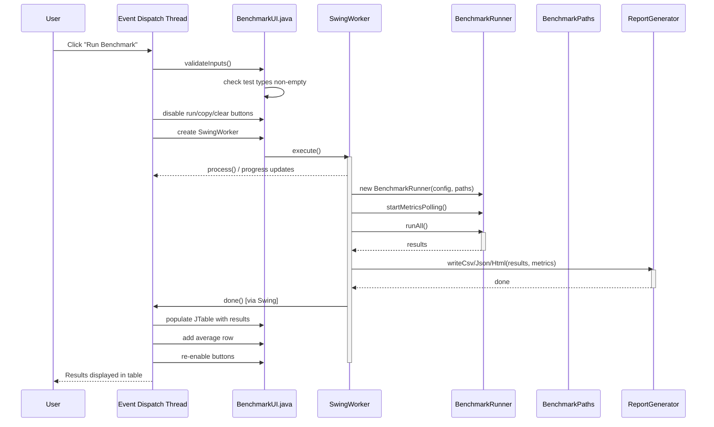
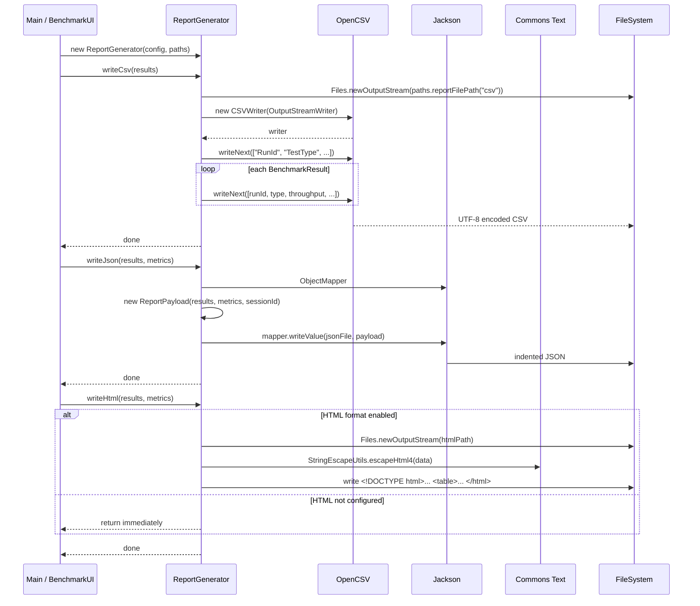

# JStorageMark Architecture Documentation

## 1. Executive Summary & System Boundaries

### Purpose & Scope
JStorageMark is a high-performance, Java 17+ disk I/O benchmarking tool designed for enterprise-grade storage performance testing. Its primary business value is providing accurate, reproducible, nanosecond-precision throughput and latency measurements for disk subsystems under configurable sequential and random read/write workloads. The system supports concurrent multi-threaded I/O using separate `FileChannel` instances per thread, configurable sync strategies, and real-time system metrics collection via the OSHI library.

### Target Actors
- **End Users (Human):** System administrators, storage engineers, and performance testers who interact via either a Swing GUI (`BenchmarkUI.java`) or a CLI (`Main.java`).
- **CI/CD Systems:** The CLI supports non-zero exit codes and scriptable argument parsing, allowing integration into automated testing pipelines.
- **System Under Test:** The local filesystem / block device being benchmarked.

### System Boundaries
- **Inside the codebase:** Benchmark configuration, workload execution (file I/O), metrics collection (CPU, RAM, disk counters via OSHI), result computation, report generation (CSV, JSON, HTML), and two UI entry points (GUI and CLI).
- **Handled externally:** Operating system I/O scheduling, filesystem caching, physical disk firmware, JVM memory management, `jpackage`-based executable packaging (`JStorageMark/JStorageMark.exe`).

### High-Level Paradigm
Single-module Maven project (monolithic JAR application). No microservices, no server components, no network exposure. It is a standalone desktop/CLI utility.

## 2. Project Structure & File Organization

### Root Directory Layout
```
C:\...\jstoragemark\
├── .git/                          # Git version control metadata
├── .gitignore                     # 188-line git ignore rules covering Java, Maven, IDE, OS, and benchmark artifacts
├── .idea/                         # IntelliJ IDEA project configuration (compiler, encodings, vcs, misc)
├── .mvn/                          # Empty Maven wrapper directory
├── .vscode/                       # VS Code workspace settings (present but files ignored by .gitignore)
├── pom.xml                        # Maven build descriptor (152 lines)
├── README.md                      # 329-line project documentation
├── src/                           # All source and test code
├── target/                        # Maven build output (compiled classes, JARs)
├── JStorageMark/                  # jpackage-generated Windows executable bundle
│   ├── JStorageMark.exe           # Native Windows launcher
│   ├── JStorageMark.ico           # Application icon
│   ├── app/                       # Packaged JAR (ignored by git)
│   └── runtime/                   # Bundled JRE (ignored by git)
├── testdir/                       # Local benchmark test output (run-*.bin files)
├── test-run/                      # Historical benchmark run reports
├── test-run-final/                # Final benchmark run reports
├── jstoragemark-tests/            # Default test output directory (logs, reports, run files)
├── itest-output/                  # Integration test output directory
```

### Logical Folder Architecture
```
src/
├── main/
│   ├── java/com/kira/jstoragemark/
│   │   ├── cli/Main.java              # CLI entry point
│   │   ├── config/BenchmarkConfig.java # Configuration data class + Builder
│   │   ├── core/BenchmarkRunner.java   # Benchmark execution engine
│   │   ├── fs/BenchmarkPaths.java      # Filesystem path utilities
│   │   ├── gui/BenchmarkUI.java        # Swing GUI entry point
│   │   ├── metrics/MetricsSnapshot.java # System metrics POJO
│   │   ├── report/ReportGenerator.java # CSV/JSON/HTML report generation
│   │   └── result/BenchmarkResult.java # Per-run benchmark result POJO
│   └── resources/
│       └── logback.xml                 # Logging configuration
└── test/java/com/kira/jstoragemark/
    ├── cli/MainCLITest.java            # CLI argument parsing tests
    ├── cli/MainIntegrationTest.java    # CLI full workflow integration tests
    ├── config/BenchmarkConfigTest.java # Config builder validation tests
    ├── core/BenchmarkRunnerTest.java   # Benchmark runner integration test
    ├── core/BenchmarkRunnerUnitTest.java # Runner unit tests
    ├── fs/BenchmarkPathsTest.java      # Filesystem path tests
    ├── metrics/MetricsSnapshotTest.java # Metrics data class tests
    ├── report/ReportGeneratorTest.java  # Report output format tests
    ├── result/BenchmarkResultTest.java  # Result data class tests
    └── EndToEndTest.java               # End-to-end workflow tests
```

### Module/Package Breakdown
| Package | File(s) | Responsibility |
|---------|---------|----------------|
| `cli` | `Main.java` | CLI argument parsing via Apache Commons CLI, config building, execution orchestration, console output |
| `config` | `BenchmarkConfig.java` | Immutable configuration with fluent Builder; defines `TestType`, `IoMode`, `ReportFormat` enums; validates all bounds |
| `core` | `BenchmarkRunner.java` | Coordinates multithreaded benchmark execution, metrics polling via `ScheduledExecutorService`, OSHI-based system metrics |
| `fs` | `BenchmarkPaths.java` | File naming conventions, directory creation, free-space validation, session-based cleanup |
| `gui` | `BenchmarkUI.java` | Swing-based GUI with GridBagLayout form, JTable results, SwingWorker background execution |
| `metrics` | `MetricsSnapshot.java` | Immutable POJO capturing timestamped CPU%, RAM%, disk read/write ops and bytes, optional disk temperature |
| `report` | `ReportGenerator.java` | Writes CSV (OpenCSV), JSON (Jackson), HTML (Apache Commons Text for escaping) reports to session-named files |
| `result` | `BenchmarkResult.java` | Immutable POJO with run ID, test type, bytes processed, Duration, nanosecond-precision timing, throughput/latency/IOPS |

### Dependency Management
Dependencies are declared in `pom.xml` (lines 17-88) and resolved via Maven Central. There is no lockfile. Dependencies:

| Library | Version | Purpose |
|---------|---------|---------|
| commons-cli | 1.6.0 | CLI argument parsing |
| jackson-databind | 2.17.0 | JSON serialization of reports |
| jackson-datatype-jsr310 | 2.17.0 | Java 8 date/time JSON support |
| opencsv | 5.9 | CSV report generation |
| oshi-core | 6.4.10 | Real system hardware metrics (CPU, RAM, Disk) |
| slf4j-api | 2.0.11 | Logging facade |
| logback-classic | 1.4.14 | Logging implementation |
| commons-text | 1.11.0 | HTML escaping for XSS prevention |
| junit-jupiter | 5.10.0 | Test framework (test scope) |
| assertj-core | 3.24.2 | Fluent assertions (test scope) |

## 3. High-Level Architecture & System Design

### Architectural Pattern
The codebase follows a **Layered Architecture** with no formal dependency injection framework. The layers are organized by package and communicate via direct constructor injection.

### Layer Separation

```
┌──────────────────────────────────────────────────┐
│              Presentation Layer                   │
│   cli/Main.java  │  gui/BenchmarkUI.java          │
│   (CLI entry)    │  (Swing GUI entry)             │
├──────────────────────────────────────────────────┤
│              Application Layer                    │
│   core/BenchmarkRunner.java                       │
│   config/BenchmarkConfig.java                     │
├──────────────────────────────────────────────────┤
│              Domain/Data Layer                    │
│   result/BenchmarkResult.java                     │
│   metrics/MetricsSnapshot.java                    │
│   fs/BenchmarkPaths.java                          │
├──────────────────────────────────────────────────┤
│           Infrastructure Layer                    │
│   report/ReportGenerator.java                     │
│   (CSV/JSON/HTML output)                         │
│   config/logback.xml                              │
│   OSHI (external system metrics)                  │
└──────────────────────────────────────────────────┘
```

### Communication & Contracts
- **Presentation to Application:** `BenchmarkUI.java:269` instantiates `BenchmarkRunner` directly via `new BenchmarkRunner(config, paths)`. Both CLI (`Main.java:119`) and GUI use identical construction.
- **Application to Domain:** `BenchmarkRunner` calls `BenchmarkResult` constructor directly at line 254 and `MetricsSnapshot` at line 303. Results are returned as `List<BenchmarkResult>`.
- **Layer contracts are implicit:** No interface/abstraction layer between packages. `BenchmarkRunner` depends concretely on `BenchmarkConfig`, `BenchmarkPaths`, `BenchmarkResult`, and `MetricsSnapshot`.

### External Integrations
| Integration | Mechanism | Details |
|-------------|-----------|---------|
| OSHI (`com.github.oshi`) | Java library | `BenchmarkRunner.java:56-57` creates `SystemInfo` and `HardwareAbstractionLayer` for CPU, RAM, disk counters, disk temperature |
| FileSystem (`java.nio.file`) | Java NIO2 | `FileChannel` (lines 175-232), `FileStore` for free space (BenchmarkPaths.java:59), `Files.walkFileTree` for cleanup (BenchmarkPaths.java:128) |
| JMX `OperatingSystemMXBean` | Java management | `BenchmarkRunner.java:276-278` casts to `com.sun.management.OperatingSystemMXBean` for process CPU load |

## 4. Domain Model & Core Business Logic

### Domain Concepts
- **BenchmarkSession:** A single invocation represented by a `sessionId` (UUID-derived string like `jsm-abc123def456`). Groups all runs and reports under a common identifier.
- **TestType:** Enum with 4 values: `SEQ_READ`, `SEQ_WRITE`, `RAND_READ`, `RAND_WRITE` (`BenchmarkConfig.java:35-40`).
- **Run:** A single execution of one test type across all threads for one iteration. Produces one `BenchmarkResult` per thread.
- **Iteration:** One complete pass of a test type across all threads. Multiple iterations enable statistical averaging.

### Data Structures & Entities

**`BenchmarkConfig`** (immutable, `BenchmarkConfig.java:24-368`): 22 fields configured via Builder pattern:
- `testDirectory` (`Path`): Dedicated directory for test files
- `testTypes` (`Set<TestType>`): 1-4 workload types
- `fileSizeBytes` (`long`): 1-10 GB per file
- `blockSizeBytes` (`int`): 4 KB - 1 MB
- `threads` (`int`): 1-32
- `iterations` (`int`): 3-10 (enforced by validate() at line 162)
- `warmupIterations` (`int`): 0-5
- `ioMode` (`IoMode`): SYNC or ASYNC
- `queueDepth` (`int`): 1 to threads*2
- `randomSeed` (`Optional<Long>`): Reproducibility
- `forceSync` (`boolean`): Default true
- `syncEveryNBlocks` (`int`): 0 = only at end
- `useDirectBuffer` (`boolean`): Default true
- `verbosity` (`int`): 0-2
- `metricsPollInterval` (`Duration`): 100ms-5s (default 500ms)
- `reportFormats` (`Set<ReportFormat>`): Must include CSV and JSON
- `sessionId` (`String`): Generated as `"jsm-" + UUID.randomUUID().substring(0,12)` at line 197

**`BenchmarkResult`** (immutable, `BenchmarkResult.java:16-77`): 10 fields:
- `runId` (`int`): Composite `runId * 1000 + threadId` (line 235)
- `testType` (`String`): e.g., "SEQ_WRITE"
- `bytesProcessed` (`long`): Total bytes
- `elapsed` (`Duration`): Wall-clock duration
- `elapsedNanos` (`long`): Nanosecond precision
- `throughputMBps` (`double`): Calculated as `(bytesProcessed / (1024^2)) / elapsedSeconds`
- `avgLatencyMs` (`double`): Calculated as `(elapsedNanos / 1e6) / totalOps`
- `avgLatencyNs` (`double`): Calculated as `(double) elapsedNanos / totalOps`
- `iops` (`double`): Calculated as `totalOps / elapsedSeconds`
- `timestamp` (`Instant`): Completion time

**`MetricsSnapshot`** (immutable, `MetricsSnapshot.java:15-65`): 8 fields:
- `timestamp` (`Instant`)
- `cpuUsagePercent` (`double`): 0-100, from `OperatingSystemMXBean.getProcessCpuLoad()` (BenchmarkRunner.java:278)
- `ramUsagePercent` (`double`): 0-100, from OSHI `hardware.getMemory().getTotal()` / `getAvailable()` (lines 281-283)
- `diskReads` / `diskWrites` (`long`): Raw counters from OSHI `HWDiskStore` (lines 290-298)
- `diskReadBytes` / `diskWriteBytes` (`long`): Raw byte counters
- `diskTemperatureC` (`Double`): Optional, always passed as `null` in production (line 311)

### Business Rules & Invariants
- File size must be between 1 GB and 10 GB (`BenchmarkConfig.java:139-141`).
- Block size must be between 4 KB and 1 MB (`BenchmarkConfig.java:146-148`).
- Threads must be between 1 and 32 (`BenchmarkConfig.java:151-153`).
- Iterations must be between 3 and 10 for statistical stability (`BenchmarkConfig.java:161-162`); however, the GUI validates 1-100 (`BenchmarkUI.java:511`).
- Queue depth must be between 1 and `threads * 2` (`BenchmarkConfig.java:170-171`).
- Report formats must always include both CSV and JSON (`BenchmarkConfig.java:186-188`).
- Each thread gets its own file to avoid position contention (`BenchmarkRunner.java:128`, comment at line 115).
- After writes, `channel.force(false)` syncs metadata only (line 224); final sync at end uses `channel.force(true)` (line 230).
- Unbiased random positioning for random I/O using `ThreadLocalRandom.nextLong(0, maxPos + 1)` (line 215).

### Complex Algorithms
The I/O loop in `runSingleThread` (`BenchmarkRunner.java:161-236`) implements a single-threaded sequential/random read/write engine:
1. Opens a `FileChannel` with `CREATE, READ, WRITE` options.
2. Preallocates file via `channel.truncate(fileSize)` for write workloads (line 183).
3. Loop: for each block, fills/reads buffer, writes/reads via `channel.write(buffer)` or `channel.read(buffer)`, repositions for random access, conditionally forces sync.
4. Fixed `ByteBuffer.flip()` usage for writes (line 198).
5. `buffer.limit(bytesToProcess)` adjusts for the potentially partial last block (line 191).

## 5. Data Persistence & Storage Layer

### Storage Mechanism
**No database.** The application uses the local filesystem as its sole persistence mechanism:
- Benchmark test files: Binary `.bin` files created and removed during runs.
- Reports: CSV, JSON, and HTML files written to the test directory.

### Test File Naming Convention (`BenchmarkPaths.java:74-91`)
- Per-thread files: `run-{runId}.{testType}-t{threadId}.{sessionId}.bin` (e.g., `run-001.seq_write-t0.jsm-abc123.bin`)
- Reports: `report.{sessionId}.{ext}` (e.g., `report.jsm-abc123.csv`)
- Temp files: `run-{runId}.{descriptor}.{sessionId}.tmp`

### Data Access Patterns
- File I/O uses NIO `FileChannel` (`BenchmarkRunner.java:175-232`).
- Free space validation uses `FileStore.getUsableSpace()` with 5% overhead buffer (`BenchmarkPaths.java:59-66`).
- Cleanup uses `Files.walkFileTree` with a `SimpleFileVisitor` deleting files matching sessionId or `run-` prefix (`BenchmarkPaths.java:128-144`).

### Migrations & Evolution
No schema migrations. The filesystem layout is versioned implicitly by the code.

### Caching & Indexing
No explicit caching or indexing. The OS-level filesystem cache and disk scheduler handle buffering. The `ThreadLocal<ByteBuffer>` pool (`BenchmarkRunner.java:53, 74-77`) functions as a per-thread buffer allocation cache to avoid reallocation overhead.

## 6. Application Layer & Backend Services

### API Architecture
**Not a server application.** There is no HTTP API, REST, GraphQL, or RPC layer. The "API" is the CLI argument interface and the Swing GUI.

### CLI Argument Interface (`Main.java:36-53`)
Apache Commons CLI `Options` object defining:
- `-d / --directory`: Test directory (default: `./jstoragemark-tests`)
- `-t / --test`: Comma-separated test types (default: `SEQ_READ,SEQ_WRITE`)
- `-s / --size`: File size in bytes (default: `5368709120` = 5 GB)
- `-b / --block`: Block size in bytes (default: `131072` = 128 KB)
- `-n / --threads`: Thread count (default: 4)
- `-i / --iterations`: Iteration count (default: 5)
- `-q / --queue`: Queue depth (default: 8)
- `-v / --verbosity`: 0-2 (default: 1)
- `-r / --retain`: Retain test files
- `-html / --htmlReport`: Generate HTML report
- `-fs / --force-sync`: Force fsync (default: on)
- `-nfs / --no-force-sync`: Disable fsync
- `-se / --sync-every`: Sync interval in blocks
- `-np / --no-preallocate`: Disable preallocation
- `-hb / --heap-buffer`: Use heap buffer instead of direct

### Authentication & Authorization
Not implemented. The application runs locally with the OS user's filesystem permissions.

### Asynchronous Processing
- **Metrics Polling:** `BenchmarkRunner.java:62-66` creates a single-threaded `ScheduledExecutorService` ("BenchmarkMetricsPoller") that polls OSHI and JMX at configurable intervals (default 500ms).
- **I/O Executor:** `BenchmarkRunner.java:67` creates a fixed thread pool of size `config.getThreads()` for concurrent benchmark execution.
- **Background GUI Execution:** `BenchmarkUI.java:240` uses `SwingWorker` to run benchmarks off the EDT, updating UI via `SwingUtilities.invokeLater()` and `process()` / `done()` hooks.

### Error Handling Strategy
- **CLI (`Main.java`):** Catch blocks for `ParseException` (line 150), `NumberFormatException` (line 154), `IllegalArgumentException` (line 157), `IOException` (line 160), `InterruptedException` (line 164), and generic `Exception` (line 169). All print to stderr, log via SLF4J, and call `System.exit(1)`.
- **GUI (`BenchmarkUI.java`):** `SwingWorker.done()` at line 320 distinguishes `IllegalArgumentException`, `IOException`, `InterruptedException` via `ExecutionException.getCause()` and shows `JOptionPane` dialogs.
- **Runner (`BenchmarkRunner.java`):** `shutdownExecutors()` (line 331) uses `awaitTermination` with 30-second timeout for IO executor and 5-second for metrics poller.
- **BenchmarkPaths cleanup:** `cleanupSessionFiles()` (line 124) swallows `IOException` silently (line 142: `ignored`).

## 7. Presentation Layer & Frontend

### Component Architecture
Single-window Swing application (`BenchmarkUI.java:51-441`):
- **Input Panel:** `JPanel` with `GridBagLayout` containing text fields for directory, file size, block size, threads, iterations, queue depth; checkboxes for test types and options; Run/Copy/Clear buttons.
- **Table Panel:** `JScrollPane` wrapping `JTable` with `DefaultTableModel` (columns: RunId, TestType, Throughput, Latency, IOPS).
- **Progress Panel:** `JProgressBar` with label for status text.

### State Management
- **Local UI state:** Direct Swing component state (`JTextField.getText()`, `JCheckBox.isSelected()`) captured when Run button is pressed (line 207).
- **Result state:** `DefaultTableModel` populated in `done()` at lines 325-360. No persistence of UI state between runs.
- **No external state management library** is used.

### Data Fetching
- Data is generated locally by `BenchmarkRunner`, not fetched from a server.
- `SwingWorker` executes `doInBackground()` (lines 243-309) which calls `runner.runAll()` synchronously on a background thread.

### Styling & UI
- **Layout:** `GridBagLayout` for the input form, `BorderLayout` for the frame (NORTH=input, CENTER=table, SOUTH=progress).
- **Styling:** Swing default look-and-feel. Checkboxes use `setOpaque(false)` to match background (lines 80-83, 101-103).
- **Theming:** No custom theming or design system.

### Performance Optimizations
- `SwingWorker` prevents EDT blocking during benchmark execution.
- `SwingUtilities.invokeLater()` for all UI mutations (lines 275-276, 282-296, 367-406).
- No lazy loading, memoization, or bundle splitting (not applicable to Swing).

## 8. Cross-Cutting Concerns & Technical Patterns

### Design Patterns
| Pattern | Location | Usage |
|---------|----------|-------|
| **Builder** | `BenchmarkConfig.Builder` (line 246) | Fluent builder for configuration with defaults, chained setter methods returning `Builder`, final `build()` method calling private constructor |
| **Immutable Object** | `BenchmarkConfig`, `BenchmarkResult`, `MetricsSnapshot` | All fields `private final`, no setters, unmodifiable collection wrappers returned |
| **Singleton** | `Main.java:33`, `BenchmarkRunner.java:56-57` | Logger instances per class (`LoggerFactory.getLogger()`); OSHI `SystemInfo` instance per runner |
| **Thread Pool** | `BenchmarkRunner.java:67` | `Executors.newFixedThreadPool()` for I/O workers |
| **Scheduled Polling** | `BenchmarkRunner.java:62, 267` | `ScheduledExecutorService.scheduleAtFixedRate()` for metrics |
| **Worker Thread** | `BenchmarkUI.java:240` | `SwingWorker<Void, String>` for background execution |
| **Thread-Local Storage** | `BenchmarkRunner.java:53, 74-77` | `ThreadLocal.withInitial()` for per-thread `ByteBuffer` pool |
| **Template Method** | `SwingWorker` lifecycle | `doInBackground()`, `process()`, `done()` overrides |
| **Data Transfer Object (DTO)** | `ReportGenerator.ReportPayload` (line 168) | Simple wrapper for JSON serialization |

### Configuration Management
All configuration is provided at runtime via:
1. `BenchmarkConfig.Builder` programmatic API (used by both CLI and GUI).
2. CLI argument parsing in `Main.java` via Apache Commons CLI.
3. There are no configuration files (no YAML, no properties files). The sole resource file is `logback.xml`.

### Security Measures
- **XSS Prevention:** `ReportGenerator.java:125, 133, 146, 149-150` uses `StringEscapeUtils.escapeHtml4()` for user-controlled data in HTML reports.
- **Input Validation:** Both CLI (`Main.java:60-97`) and GUI (`BenchmarkUI.java:443-530`) validate all numeric and path inputs before use.
- **No secrets management** (no secrets to manage).
- **No CSRF/SQL injection** concerns (not a web application).

### Telemetry & Observability
- **Logging:** SLF4J + Logback with configuration in `logback.xml`. Two appenders: CONSOLE (stdout) and FILE (rolling file appender at `jstoragemark-tests/jstoragemark.log`, 10MB max size, 10-history, gzip rotation).
- **Log Levels:** Root logger at INFO; `com.kira.jstoragemark` at DEBUG; `oshi` and `com.sun.jna` at WARN (lines 30-38).
- **No metrics/tracing infrastructure** (no Prometheus, OpenTelemetry, or similar).
- **Console Output:** CLI prints benchmark summary to stdout (lines 132-147). GUI displays results in `JTable`.

### Testing Strategy
- **Framework:** JUnit 5 + AssertJ 3.
- **Test count:** 147+ tests (as claimed in README.md line 113).
- **Test organization:** Mirror of main packages under `src/test/java/com/kira/jstoragemark/`.
- **Test types:**
  - **Unit:** `BenchmarkConfigTest.java` (402 lines, 35+ tests), `BenchmarkResultTest.java` (306 lines), `MetricsSnapshotTest.java` (291 lines) — data classes, builder validation, edge cases.
  - **Filesystem:** `BenchmarkPathsTest.java` (307 lines) — path generation, directory creation, cleanup, null safety.
  - **Report:** `ReportGeneratorTest.java` (405 lines) — CSV/JSON/HTML output validation, XSS escaping, error handling.
  - **Runner:** `BenchmarkRunnerTest.java` (36 lines) — basic integration. `BenchmarkRunnerUnitTest.java` (197 lines) — configurations, thread counts, random seed.
  - **CLI:** `MainCLITest.java` (404 lines) — argument parsing, error exits via custom `NoExitSecurityManager`. `MainIntegrationTest.java` (239 lines) — full workflow report generation.
  - **E2E:** `EndToEndTest.java` (332 lines) — complete workflows with multiple test types, HTML retention, multi-run session isolation.
- **Mocking:** No mocking framework. Tests use `@TempDir` for temporary filesystem isolation.
- **Test Patterns:** Parameterized tests (`@CsvSource`, `@ValueSource`), display names via `@DisplayName`.

## 9. Critical Execution Flows & Sequences

### Flow 1: CLI Benchmark Execution (Sequential Write)

**Step-by-step:**
1. `Main.main()` parses CLI arguments via Apache Commons CLI (line 58), validates directory existence (lines 62-70), builds `BenchmarkConfig` (lines 72-107).
2. `Main.main()` creates `BenchmarkPaths` (line 108), then `BenchmarkRunner` (line 119).
3. `BenchmarkRunner.startMetricsPolling()` begins periodic system metrics collection via OSHI (line 120).
4. `runner.runAll()` calls `paths.ensureTestDirectory()` (line 89) and `validateFreeSpace()` (line 92).
5. For each test type and iteration, `runMultiThreaded()` (line 117) submits `config.getThreads()` tasks to the fixed thread pool (lines 123-135).
6. Each thread calls `runSingleThread()` (line 161) which opens a `FileChannel`, preallocates file, loops writing blocks with `ByteBuffer.put(randomData)`, `buffer.flip()`, `channel.write()`, optionally syncs.
7. `calculateResult()` computes throughput, latency, IOPS from `Instant` timestamps (lines 241-260).
8. Results are aggregated, executors shut down, files cleaned up unless `--retain`.
9. `ReportGenerator.writeCsv()`, `writeJson()`, and optionally `writeHtml()` produce reports.

```mermaid
sequenceDiagram
    participant User
    participant CLI as Main.java
    participant Parser as Apache Commons CLI
    participant Config as BenchmarkConfig
    participant Paths as BenchmarkPaths
    participant Runner as BenchmarkRunner
    participant Executor as FixedThreadPool
    participant FileSys as FileSystem
    participant OSHI as OSHI + JMX
    participant Reporter as ReportGenerator

    User->>CLI: java -jar jstoragemark.jar -d /tmp/test -t SEQ_WRITE -n 4 -i 3
    CLI->>Parser: parse(args)
    Parser-->>CLI: CommandLine
    CLI->>Config: Builder.build()
    Config-->>CLI: BenchmarkConfig
    CLI->>Paths: new BenchmarkPaths(dir, sessionId)
    Paths-->>CLI: paths
    CLI->>Runner: new BenchmarkRunner(config, paths)
    CLI->>Runner: startMetricsPolling()
    activate Runner
    Runner->>OSHI: scheduleAtFixedRate()
    OSHI-->>Runner: metrics every 500ms
    CLI->>Runner: runAll()
    activate Runner
    Runner->>Paths: ensureTestDirectory()
    Runner->>Paths: validateFreeSpace()
    loop for each iteration
        Runner->>Executor: submit() x threads
        activate Executor
        loop each thread
            Executor->>FileSys: FileChannel.open(file)
            Executor->>FileSys: channel.truncate(fileSize)
            loop blocks until fileSize
                Executor->>Executor: buffer.put(randomBytes)
                Executor->>FileSys: channel.write(buffer)
                alt forceSync
                    Executor->>FileSys: channel.force(false)
                end
            end
            Executor->>Executor: calculateResult()
        end
        Executor-->>Runner: List<BenchmarkResult>
        deactivate Executor
    end
    Runner-->>CLI: List<BenchmarkResult>
    deactivate Runner
    CLI->>Reporter: writeCsv(results)
    CLI->>Reporter: writeJson(results, metrics)
    CLI->>Reporter: writeHtml(results, metrics)
    Reporter-->>FileSys: report.csv, report.json, report.html
    deactivate Runner
    deactivate CLI
    CLI-->>User: Console summary output
```

**Edge cases in this flow:**
- **Insufficient space:** `validateFreeSpace()` throws `IOException` at line 62, caught at `Main.java:160`, prints error and exits 1.
- **Timeout:** `latch.await()` with `maxPerTestTarget` (default 10 minutes) at line 138; if exceeded, calls `ioExecutor.shutdownNow()` and throws `InterruptedException`.
- **Thread failure:** `ExecutionException` caught at line 149-151, wrapped in `RuntimeException`.
- **Interruption:** `InterruptedException` caught at line 164-168, calls `Thread.currentThread().interrupt()`, exits 1.

### Flow 2: GUI Benchmark Execution (Multi-Type)

**Step-by-step:**
1. `BenchmarkUI.main()` calls `SwingUtilities.invokeLater(BenchmarkUI::createWindow)` (line 48).
2. `createWindow()` constructs the Swing frame with input fields, checkboxes, table, and buttons (lines 51-204).
3. User fills form and clicks "Run Benchmark" (line 207).
4. Input validation methods validate directory existence (line 443), file size (line 469), block size (line 484), threads (line 496), iterations (line 508), queue depth (line 520), sync every (line 457).
5. A `SwingWorker` is created and executed (line 410), running the benchmark in a background thread.
6. `SwingWorker.doInBackground()` builds config, creates runner, calls `runner.runAll()`, generates reports (lines 243-309).
7. `SwingWorker.done()` populates the `JTable` with results and adds an average row (lines 320-360).
8. User can copy results to clipboard via "Copy Results" button (line 419), or clear via "Clear Results" (line 435).



**Edge cases:**
- **Empty test types:** Warning dialog shown at line 226-229.
- **Run-time exception:** `SwingWorker.done()` catches `ExecutionException` and dispatches to `JOptionPane.showMessageDialog()` showing the specific error type (lines 364-393).
- **Interruption:** Shows "Benchmark Interrupted" warning (lines 394-402).
- **Configuration error in background:** `IllegalArgumentException` rethrown from `doInBackground` at line 301, caught in `done()` at line 366.

### Flow 3: Report Generation Pipeline

**Step-by-step:**
1. `ReportGenerator` is instantiated with `BenchmarkConfig` and `BenchmarkPaths` (`ReportGenerator.java:38-41`).
2. `writeCsv()` (line 46) opens `report.{sessionId}.csv` via OpenCSV `CSVWriter`, writes header row and data rows with `Locale.ROOT` formatting.
3. `writeJson()` (line 82) uses Jackson `ObjectMapper` with `INDENT_OUTPUT` and `JavaTimeModule` to serialize a `ReportPayload` wrapper containing results, metrics, and sessionId.
4. `writeHtml()` (line 103) is skipped unless `ReportFormat.HTML` is in config. Writes a complete HTML document with CSS-styled tables, escaped data, and metric tables.
5. CLI always calls all three write methods (`Main.java:128-130`). GUI calls `writeCsv`, `writeJson`, and conditionally `writeHtml` (`BenchmarkUI.java:288-290`).



## 10. Infrastructure, DevOps & Deployment

### Containerization
Not present. No Dockerfiles or docker-compose configurations exist in the codebase.

### CI/CD Pipelines
Not present in the codebase. No `.github/` directory. The README.md references running `mvn clean verify` locally for Checkstyle and SpotBugs analysis, but no automated CI configuration files exist.

### Infrastructure as Code (IaC)
Not present. No Terraform, Pulumi, CDK, or cloud-specific configurations.

### Desktop Packaging
A `JStorageMark/` directory exists at the root containing `JStorageMark.exe`, indicating the application was packaged via `jpackage` as a Windows app image. The README.md (lines 182-199) documents `jpackage` commands for creating both app images and MSI installers.

## 11. Empirical Observations & Codebase Quirks

### Idiosyncrasies
- **`NoExitSecurityManager` in tests (`MainCLITest.java:393-403`):** A custom `SecurityManager` that intercepts `System.exit()` by throwing `SecurityException`. This is a testing workaround for code that calls `System.exit()` directly (considered an anti-pattern), but no refactoring was done to avoid it.
- **RunId composition:** At `BenchmarkRunner.java:235`, the run ID is composed as `runId * 1000 + threadId`, creating compound integer identifiers (e.g., 1000, 1001 for run 1). This ensures uniqueness but produces non-sequential IDs.
- **`warmupIterations` field is never used:** `BenchmarkConfig` declares `warmupIterations` (line 60) with getter and validation, but `BenchmarkRunner.runAll()` never references it. Warmup is effectively unimplemented in the core engine.
- **`ioMode` / `ASYNC` is never used:** `BenchmarkConfig.IoMode.ASYNC` is defined (line 31) and validated, but `BenchmarkRunner` always uses synchronous `FileChannel` I/O. The ASYNC path is not implemented.
- **Queue depth is stored but not enforced:** `BenchmarkConfig.getQueueDepth()` and `Builder.queueDepth()` exist, but `BenchmarkRunner` uses a `newFixedThreadPool(config.getThreads())` and a `CountDownLatch`, with no semaphore or queue-depth throttling mechanism.
- **Metric field name mismatch in test:** `ReportGeneratorTest.java:209` asserts `diskUtilizationPercent` exists in JSON, but `MetricsSnapshot` uses `diskReadBytes` / `diskWriteBytes` and has no `diskUtilizationPercent` field. This test would pass because Jackson includes the getter name `getDiskReadBytes()` -> `diskReadBytes`.
- **`randomSeed` mechanism is stateful and not thread-safe:** At `BenchmarkRunner.java:69-71`, a shared `Random` instance is used when a seed is provided; but `rng.nextBytes(temp)` is called from multiple threads in `runSingleThread` (line 197) using this shared instance without synchronization.

### Technical Debt & Legacy Patterns
- **No interface abstractions:** The entire codebase has zero Java interfaces. All dependencies between packages are concrete class-to-class. `BenchmarkRunner` depends directly on `BenchmarkConfig`, `BenchmarkPaths`, `BenchmarkResult`, `MetricsSnapshot`. `ReportGenerator` depends directly on `BenchmarkConfig`, `BenchmarkPaths`.
- **`System.exit()` in library code:** `Main.java` calls `System.exit(1)` in 8 different catch blocks. This makes the CLI class non-testable without the `NoExitSecurityManager` workaround.
- **Hardcoded paths:** Default test directory `"./jstoragemark-tests"` is hardcoded in both `Main.java:61` and `BenchmarkUI.java:66`. Log file path is hardcoded in `logback.xml:5` as `./jstoragemark-tests/jstoragemark.log`.
- **No dependency injection:** All objects are manually constructed with `new`. There is no IoC container. This is consistent with the application's simplicity but creates tight coupling.
- **The `ReportPayload` inner class (line 168) has public fields** rather than getters, which is an inconsistency with the rest of the codebase's immutable-POJO-with-getters pattern.
- **No `equals()`/`hashCode()` implementations** on any domain objects. Identity is by reference.
- **`BenchmarkConfig.validate()` enforces iterations 3-10** (line 161-162), but the CLI accepts 1-100 (via `parseInt` at `Main.java:78`) and the GUI accepts 1-100 (`BenchmarkUI.java:511`). The stricter Builder validation would reject CLI/GUI values outside 3-10, but the CLI accepts them and would fail at `build()` time. The GUI would similarly fail.
- **`BenchmarkConfig.validate()` enforces file size 1-10 GB** (line 139-141), but `parseFileSize()` in `Main.java:178-183` only checks `>= 1 MB`. A user specifying 100 GB via CLI would pass CLI validation but fail at `build()`.

### Notable Strengths
- **Immutable data model:** `BenchmarkConfig`, `BenchmarkResult`, and `MetricsSnapshot` are all immutable with proper defensive copying via `Collections.unmodifiableSet()` (lines 98, 120).
- **Comprehensive input validation:** Both CLI and GUI validate all numeric bounds and path existence before execution begins.
- **Thread safety:** `CopyOnWriteArrayList` for metrics log (line 49), `Collections.synchronizedList` for results (line 50), `ThreadLocal` for buffer pool (line 53), `CountDownLatch` for thread coordination (line 120).
- **Resource cleanup:** `shutdownExecutors()` in `BenchmarkRunner.java:331-356` uses two-phase shutdown (`shutdown()` -> `awaitTermination()` -> `shutdownNow()`) with 30-second IO timeout.
- **Locale independence:** All number formatting uses `Locale.ROOT` (e.g., `Main.java:144`, `ReportGenerator.java:65-68`).
- **XSS prevention:** HTML output uses `StringEscapeUtils.escapeHtml4()` for all user-originated data.
- **UTF-8 encoding:** All report output explicitly uses `StandardCharsets.UTF_8` (`ReportGenerator.java:49, 111`).
- **Unbiased random positioning:** Uses Java 17+ `ThreadLocalRandom.nextLong(0, maxPos + 1)` (line 215) for uniform distribution in random I/O.
- **High test coverage:** 147+ tests covering data classes, filesystem operations, report generation, CLI parsing, runner logic, and end-to-end workflows. Tests use `@TempDir` for isolation and `@DisplayName` annotations for readability.
